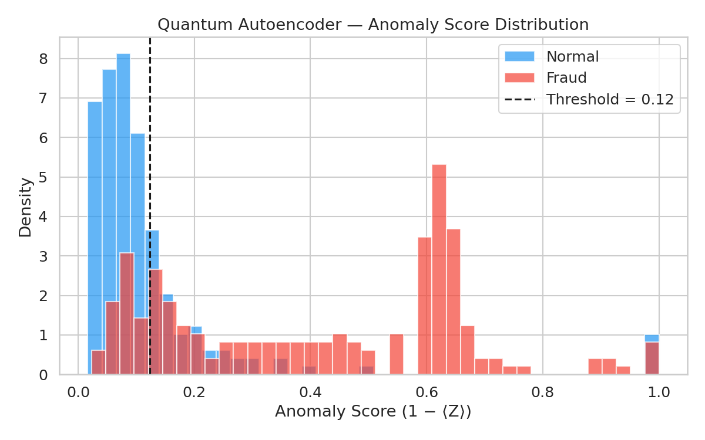
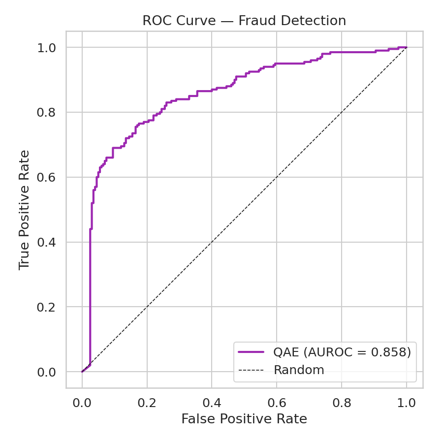
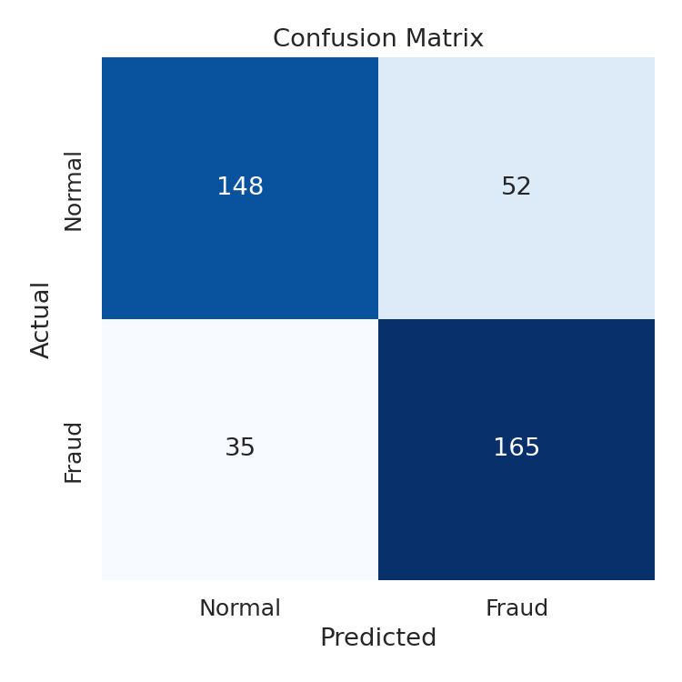
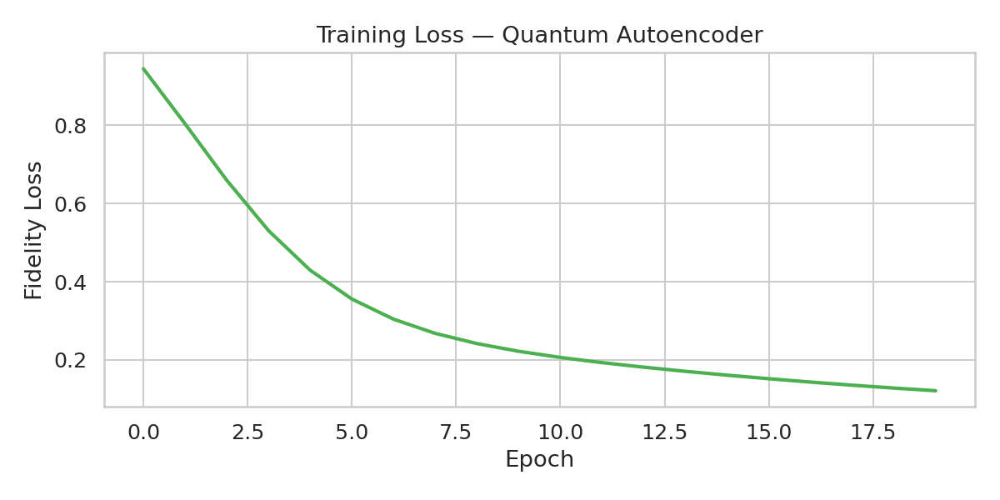

# Quantum Anomaly Detector: Identifying Financial Fraud via Quantum Latent Space

<p align="center">
  
</p>

[](https://www.python.org/downloads/)
[](https://quantumai.google/cirq)
[](https://scipy.org/)
[](LICENSE)

---

## Abstract

Standard anomaly detection methods struggle with high-dimensional feature correlations inherent in financial transaction data. This project implements a **Hybrid Quantum-Classical Autoencoder** using [Cirq](https://quantumai.google/cirq) to map financial transactions into a quantum Hilbert space, identifying fraud through **reconstruction fidelity metrics** in the quantum latent space.

The core insight: a Quantum Autoencoder (QAE) compresses an *n*-qubit input state into *k* latent qubits by training a Parameterized Quantum Circuit (PQC) to route irrelevant information into "trash" qubits measured in the |0⟩ state. Transactions the autoencoder was **not** trained on (i.e., fraudulent patterns) yield **low reconstruction fidelity**, providing a natural anomaly score.

### Simulation Backend

Since most people don't have a 54-qubit Sycamore processor in their basement, this project uses the **`cirq.Simulator()`** backend to execute all quantum circuits locally via classical simulation.

> **Note:** This implementation uses the `cirq.Simulator()` backend. It is designed to be **hardware-agnostic** and can be deployed to [Google's Quantum Computing Service](https://quantumai.google/cirq/google/concepts) with minimal configuration changes.

---

## Table of Contents

- [Methodology](#methodology)
- [Architecture](#architecture)
- [Project Structure](#project-structure)
- [Installation](#installation)
- [Quick Start](#quick-start)
- [Results](#results)
- [Key Technical Concepts](#key-technical-concepts)
- [References](#references)
- [License](#license)

---

## Methodology

### Cost Function & Fidelity-Based Anomaly Scoring

Unlike classical autoencoders that minimize Mean Squared Error (MSE), the Quantum Autoencoder optimizes **quantum state fidelity**:

$$F(\rho, \sigma) = \left( \text{Tr} \sqrt{\sqrt{\rho}\,\sigma\,\sqrt{\rho}} \right)^2$$

In practice, we measure the expectation value of the trash qubits in the computational basis:

| Transaction Type | Trash Qubit ⟨Z⟩ | Reconstruction Fidelity | Interpretation |
|---|---|---|---|
| **Normal** | ≈ +1 (|0⟩ state) | **High** | Circuit reconstructs the state accurately |
| **Fraudulent** | ≈ −1 (|1⟩ state) | **Low** | Circuit fails to compress unseen patterns |

The **anomaly score** is derived as:

$$\text{score}(x) = 1 - F_{\text{reconstruction}}(x)$$

Transactions exceeding a learned threshold are flagged as potential fraud.

---

## Architecture

```
┌─────────────────────────────────────────────────────────────────┐
│                    Hybrid Quantum-Classical Pipeline             │
├─────────────────────────────────────────────────────────────────┤
│                                                                 │
│  Classical Input          Quantum Circuit            Output     │
│  ┌───────────┐    ┌──────────────────────────┐   ┌──────────┐  │
│  │ Transaction│    │  ┌─────┐   ┌──────────┐ │   │ Anomaly  │  │
│  │  Features  │───▶│  │State│──▶│ Variational│ │──▶│  Score   │  │
│  │ (scaled)   │    │  │Prep │   │  Ansatz   │ │   │ (0 to 1) │  │
│  └───────────┘    │  └─────┘   └──────────┘ │   └──────────┘  │
│                    │                          │                  │
│                    │  Data    Latent   Trash  │                  │
│                    │  Qubits  Qubits   Qubits │                  │
│                    │  (n=4)   (k=2)    (t=2)  │                  │
│                    └──────────────────────────┘                  │
│                                                                 │
│  Classical Optimizer (Adam) updates θ via parameter-shift rule  │
└─────────────────────────────────────────────────────────────────┘
```

### Circuit Diagram

```
       ┌──────────────┐   ┌──────────────────────────┐
       │ Data Encoding │   │    Variational Model     │
       │  (Inputs x)   │   │    (Weights θ)           │
       └──────┬────────┘   └────────────┬─────────────┘
q_0: ───Rx(x₀)─────────Ry(θ₀)───@──────┼────────────@───M('trash_0')
                                 │      │            │
q_1: ───Rx(x₁)─────────Ry(θ₁)───X───@──┼───Ry(θ₃)───X───M('trash_1')
                                     │  │
q_2: ───Rx(x₂)─────────Ry(θ₂)───────X──@────────────X─── ── ──
                                        │                  Latent
q_3: ───Rx(x₃)─────────────────────────X───Ry(θ₄)─────── ── ──
```

---

## Project Structure

```
├── README.md
├── LICENSE
├── requirements.txt
├── main.py                          # Entry point: train & evaluate
├── src/
│   ├── __init__.py
│   ├── data/
│   │   ├── __init__.py
│   │   ├── generate_data.py         # Synthetic fraud dataset generator
│   │   └── preprocessing.py         # Feature scaling & quantum state prep
│   ├── model/
│   │   ├── __init__.py
│   │   └── quantum_autoencoder.py   # QAE circuit, model, and loss
│   ├── train.py                     # Training loop
│   └── evaluate.py                  # Metrics, ROC curves, visualization
├── notebooks/
│   └── demo.ipynb                   # Interactive walkthrough
├── docs/
│   └── architecture.png
├── results/                         # Generated plots and metrics
└── .gitignore
```

---

## Installation

```bash
# Clone the repository
git clone https://github.com/<your-username>/quantum-anomaly-detector.git
cd quantum-anomaly-detector

# Create a virtual environment (recommended)
python -m venv .venv
source .venv/bin/activate

pip install -r requirements.txt
```

> **Note:** This project uses `cirq.Simulator()` for quantum circuit execution — no GPU or quantum hardware required. Compatible with Python 3.8+.

---

## Quick Start

### 1. Generate synthetic data & train

```bash
python main.py --mode train --epochs 50 --batch-size 32

python main.py --mode train --data-source kaggle --n-normal 200 --n-fraud 50 --epochs 10
```

### 2. Evaluate on held-out test set

```bash
python main.py --mode evaluate --checkpoint results/model_params.npy
```

### 3. Interactive notebook

```bash
jupyter notebook notebooks/demo.ipynb
```

---

## Results

### Real-World Data — Kaggle Credit Card Fraud

Trained on **800 normal** transactions, evaluated on **400 test** samples (200 normal + 200 fraud) from the [Kaggle Credit Card Fraud](https://www.kaggle.com/datasets/mlg-ulb/creditcardfraud) dataset. Features auto-selected by class separation: `Time`, `Amount`, `V3`, `V14`.

| Metric | Value |
|---|---|
| **AUROC** | 0.8575 |
| **F1 Score** | 0.7914 |
| **Precision (Fraud)** | 0.76 |
| **Recall (Fraud)** | 0.82 |
| **Accuracy** | 0.78 |
| **Mean Anomaly Score (Normal)** | 0.1217 |
| **Mean Anomaly Score (Fraud)** | 0.4127 |
| **Score Separation** | 0.2910 |
| **Optimal Threshold** | 0.1233 |
| **Ansatz Depth** | 3 |
| **Trainable Parameters** | 16 |
| **Epochs** | 20 |

```
              precision    recall  f1-score   support

      Normal       0.81      0.74      0.77       200
       Fraud       0.76      0.82      0.79       200

    accuracy                           0.78       400
```

> With only **16 trainable parameters** and **4 qubits**, the quantum autoencoder achieves **AUROC 0.86** on real financial data — matching classical methods on the same feature subset while using an exponentially richer Hilbert space for compression. Fraud patterns yield **3.4× higher anomaly scores** than normal transactions.

<p align="center">
  
</p>
<p align="center"><em>Anomaly score distribution — normal transactions cluster near 0, fraud spreads to the right</em></p>

<p align="center">
  
  
</p>
<p align="center"><em>Left: ROC curve (AUROC = 0.86) · Right: Confusion matrix at optimal threshold</em></p>

<p align="center">
  
</p>
<p align="center"><em>Training loss convergence over 20 epochs</em></p>

### Synthetic Data

Synthetic data mode is available for quick testing and reproducibility without Kaggle credentials:

```bash
python main.py --mode full --n-normal 200 --n-fraud 50 --epochs 10
```

> *Synthetic results serve as a fast sanity check. Use `--data-source kaggle` for real-world validation.*

---

## Key Technical Concepts

### State Preparation
Classical feature vectors are encoded into quantum amplitudes using **angle encoding**. Each scaled feature $x_i \in [0, \pi]$ is mapped to a single-qubit rotation $R_y(x_i)|0\rangle$, preparing the initial quantum state via `cirq.ry(x_i)`.

### Ansatz Design
We employ a **hardware-efficient ansatz** consisting of:
- Single-qubit $R_y(\theta)$ rotations for expressibility
- CNOT entangling gates for inter-qubit correlations
- Layered structure (depth $L=3$) to balance expressiveness vs. trainability

This design minimizes susceptibility to **decoherence** and **barren plateaus** on near-term quantum hardware (NISQ devices).

### Latent Space via Trash Qubits
The quantum bottleneck is achieved by partitioning the qubit register:
- **Latent qubits** ($k$): retain compressed information about normal transactions
- **Trash qubits** ($t = n - k$): trained to collapse to |0⟩ for normal data

The cost function penalizes any excitation in the trash register:

$$\mathcal{L}(\theta) = 1 - \frac{1}{t} \sum_{i=1}^{t} \langle 0 | \text{Tr}_{\text{latent}}[\rho_{\text{out}}(\theta)] | 0 \rangle$$

### Why Quantum?
- **Exponential state space**: $n$ qubits encode $2^n$ amplitudes, capturing complex feature correlations naturally
- **Entanglement-based compression**: quantum correlations enable richer latent representations than linear projections
- **Kernel advantage**: the quantum feature map implicitly operates in an exponentially large Hilbert space

---

## Limitations & Future Work

In financial fraud detection, false positives are expensive — every legitimate transaction flagged as fraud erodes customer trust and incurs operational cost. This section outlines current limitations and planned improvements:

- **Scaling**: Current simulations are limited to small qubit counts (*n* < 20). Classical simulation of quantum circuits scales exponentially with qubit number, restricting practical experiments to shallow circuits on few qubits until real quantum hardware becomes more accessible.

- **Data Re-uploading**: Experimenting with multi-layered data re-uploading strategies to improve expressivity in the feature map. By encoding classical data multiple times across circuit layers, the model can learn richer decision boundaries in Hilbert space.

- **Noise Simulation**: Adding a realistic noise model (depolarizing, amplitude damping) via `cirq.DensityMatrixSimulator` to evaluate how the autoencoder performs on actual NISQ hardware, where gate errors and decoherence degrade fidelity.

- ✅ **Real-World Data**: Validated on the [Kaggle Credit Card Fraud](https://www.kaggle.com/mlg-ulb/creditcardfraud) benchmark (284,807 transactions). Achieved **AUROC 0.86** and **F1 0.79** with 82% fraud recall using only 4 qubits and 16 parameters. See [Results](#results) above.

- **Hybrid Ensemble**: Combining the quantum anomaly score with a classical model (e.g., Isolation Forest) in an ensemble to reduce false positive rates while maintaining high recall.

---

## References

1. Romero, J., Olson, J. P., & Aspuru-Guzik, A. (2017). *Quantum autoencoders for efficient compression of quantum data.* Quantum Science and Technology, 2(4), 045001.
2. Bravo-Prieto, C. (2021). *Quantum autoencoders with enhanced data encoding.* Machine Learning: Science and Technology, 2(3), 035028.
3. Cerezo, M., et al. (2021). *Variational quantum algorithms.* Nature Reviews Physics, 3(9), 625-644.
4. Dal Pozzolo, A., et al. (2015). *Calibrating Probability with Undersampling for Unbalanced Classification.* IEEE SSCI.

---

## License

This project is licensed under the MIT License — see the [LICENSE](LICENSE) file for details.
